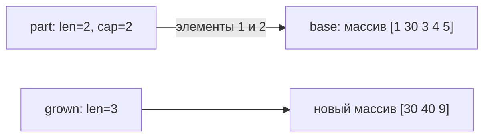

# Slice в Go

Slice описывает последовательный segment underlying array. Копирование slice копирует descriptor, а не элементы, поэтому копии обычно разделяют данные.

## `len`, `cap` и создание

```go
var nilSlice []int          // len=0, cap=0, nil
empty := []int{}            // len=0, cap=0, non-nil
values := make([]int, 3, 8) // len=3, cap=8; элементы равны zero value
```

`len` — доступная длина; `cap` — сколько элементов можно охватить reslicing от начала slice до конца underlying array. `make([]T, n)` создаёт n элементов, а не только резервирует capacity. Для пустого, но заранее ёмкого результата используйте `make([]T, 0, n)`.

Nil и empty slice одинаково работают с `len`, `cap`, `range` и `append`, но могут различаться в API/serialization (`encoding/json` обычно кодирует nil как `null`, empty как `[]`). Зафиксируйте контракт boundary явно.

## Reslicing и full slice expression

```go
base := []int{1, 2, 3, 4}
part := base[1:3]   // len=2, capacity extends into base
safe := base[1:3:3] // max bound limits capacity to 2
```

Full slice expression `a[low:high:max]` задаёт `cap = max-low`. Если выбрать `max=high`, capacity равна длине: `append` хотя бы одного элемента выделит новый array и не перезапишет элементы исходного массива за `high`. Если `max > high`, свободная capacity остаётся и добавление может использовать общий array.

Ограничение capacity не изолирует уже существующие элементы: запись по индексу по-прежнему меняет общий массив.

```go
package main

import "fmt"

func main() {
	base := [5]int{1, 2, 3, 4, 5}
	part := base[1:3:3] // len=2, cap=2
	part[0] = 30
	grown := append(part, 9) // capacity недостаточно: новый массив
	grown[1] = 40
	fmt.Println(base)  // [1 30 3 4 5]
	fmt.Println(part)  // [30 3]
	fmt.Println(grown) // [30 40 9]
}
```



Схема показывает связь данных после выполнения примера, а не физический layout slice descriptor.

## `append`

`append` возвращает новый slice value. Если capacity достаточно, данные добавляются в существующий array; иначе выделяется другой array и элементы копируются.

```go
s = append(s, value) // результат обязательно сохранить
```

Алгоритм роста capacity — implementation detail. Нельзя рассчитывать на удвоение или конкретный threshold. Если известен разумный верхний размер, preallocation уменьшает reallocations, но чрезмерная capacity удерживает память.

### Aliasing bug

```go
func addFooter(payload []byte) []byte {
	return append(payload, '\n')
}
```

Функция может изменить array caller или вернуть независимый array — зависит от capacity. Если ownership должен быть независимым, копируйте явно:

```go
owned := append([]byte(nil), payload...)
owned = append(owned, '\n')
```

## `copy` и overlap

`copy(dst, src)` копирует `min(len(dst), len(src))` элементов и корректно поддерживает overlapping slices.

```go
values := []int{1, 2, 3, 4}
copy(values[1:], values[:3]) // [1 1 2 3]
```

Для вставок, удаления, cloning и compact operations используйте generic пакет `slices`, если он выражает намерение яснее ручных `append`/`copy`.

## `clear`

`clear(s)` присваивает zero value каждому элементу текущей длины. Длина и capacity не меняются. Для slice pointers это помогает разорвать ссылки перед повторным использованием большого buffer, но сам backing array остаётся выделенным, пока достижим.

```go
clear(values)
values = values[:0]
```

## Удержание памяти

Маленький subslice удерживает весь backing array достижимым:

```go
func prefix(data []byte) []byte {
	return data[:16] // может удерживать многомегабайтный data
}
```

Если срок жизни prefix велик, создайте независимую копию: `bytes.Clone(data[:16])` или `slices.Clone(data[:16])`.

## Передача между goroutines

Копия slice не даёт synchronization и не защищает elements. Одновременная запись и чтение общего backing array без happens-before — data race. Передавайте ownership, копируйте данные или синхронизируйте доступ.

## Что гарантирует язык

- Slice index должен быть в пределах `len`, иначе panic.
- Если capacity достаточно, `append` переиспользует underlying array; иначе выделяет новый. Это гарантия спецификации. Размер новой capacity и алгоритм её роста не гарантированы.
- `copy` работает при overlap.
- Slice не comparable, кроме сравнения с `nil`.
- Конкретный layout descriptor и growth policy не являются API.

## Вопросы для самопроверки

1. Почему две копии slice могут видеть изменения друг друга?
2. Что меняет третий index в `a[low:high:max]`?
3. Почему маленький subslice способен удерживать большой объём памяти?
4. Гарантирует ли preallocation отсутствие всех allocations?

## См. также

- [Управление памятью](../runtime/memory-management.md)
- [Data races](../concurrency/data-races.md)

## Источники

- [Go specification: Slice types](https://go.dev/ref/spec#Slice_types)
- [Go specification: Appending to and copying slices](https://go.dev/ref/spec#Appending_and_copying_slices)
- [Go blog: Go Slices: usage and internals](https://go.dev/blog/slices-intro)
- [`slices` package](https://pkg.go.dev/slices)
