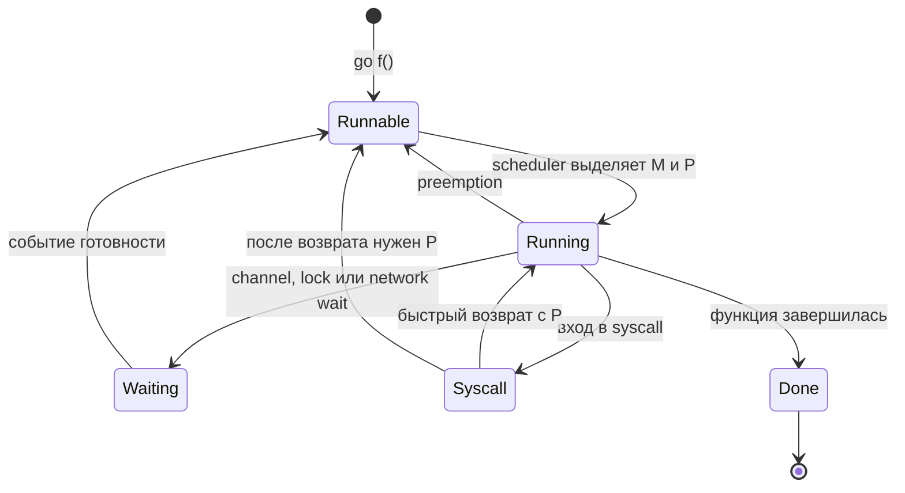

# Scheduler Go

> Детали этой страницы относятся к standard Go toolchain 1.27 и не являются контрактом языка.

Scheduler multiplexes runnable goroutines over OS threads. Пользователь пишет blocking-style code, а runtime координирует выполнение, network polling, syscalls, timers, preemption и garbage collection.

## G, M и P

- **G** — goroutine state: stack, instruction position и scheduler metadata.
- **M** — OS thread, выполняющий Go или runtime code.
- **P** — ресурс выполнения Go code и локальное scheduler/allocator state.

M обычно нужен P, чтобы выполнять Go goroutine. Число P связано с `GOMAXPROCS`; это available parallelism, а не предел goroutines или OS threads.

## Очереди и work stealing

Runnable G попадают в per-P local queues или global queue. P ищет локальную работу, может забирать global work и steal часть работы у другого P. Точные размеры очередей, частота global checks и порядок выбора — изменяемые implementation details, а не fairness guarantees.

CPU-bound goroutines конкурируют за P. I/O-bound goroutines часто park, позволяя тому же P выполнять другую работу.

Это упрощённая схема состояний standard runtime, без внутренних transitions GC/stack scanning. Возврат из ожидания делает goroutine runnable, но не гарантирует немедленное выполнение.

## Syscalls и netpoller

При blocking syscall runtime может отделить P от заблокированного M, чтобы другой M продолжил Go work. Не каждый syscall одинаков: cgo, thread-affine code и foreign libraries могут удерживать threads и требовать отдельной диагностики.

Network file descriptors в non-blocking mode интегрируются с OS poller. Goroutine park до readiness, не занимая P активным ожиданием. Подробнее: [Netpoller](netpoller.md).

## Preemption и sysmon

Runtime умеет preempt long-running goroutines, чтобы GC и другие goroutines продвигались. `sysmon` помогает с timers, preemption, network polling и retaking resources после долгих syscalls. Не привязывайте reasoning к конкретному period или числу scheduler ticks.

## `GOMAXPROCS` в контейнерах

С Go 1.25 default может учитывать logical CPUs, CPU affinity и на Linux cgroup CPU bandwidth limit; runtime периодически обновляет значение при изменении environment. Для language version 1.24 и ниже по умолчанию действуют `GODEBUG=containermaxprocs=0,updatemaxprocs=0`: новая версия toolchain сама по себе не включает эти defaults для старого модуля. Проверяйте `go` directive главного модуля и GODEBUG overrides. CPU requests Kubernetes не учитываются.

В проверенной реализации Go 1.27.1 дробная quota округляется вверх; runtime обычно не выбирает значение ниже 2, если число logical CPUs и CPU affinity позволяют 2. Поэтому `GOMAXPROCS` не обязательно равен CPU limit.

Положительный `GOMAXPROCS` environment variable или вызов `runtime.GOMAXPROCS(n)` с `n > 0` задаёт ручное значение и отключает автоматические updates. Вызов с `n <= 0` только читает настройку. `runtime.SetDefaultGOMAXPROCS()` восстанавливает default behavior с учётом GODEBUG.

Это уменьшает риск, когда process на большой node считает доступными все CPUs, но container имеет малую quota и регулярно попадает под CPU throttling. Однако выставлять или не выставлять CPU limit — отдельный infrastructure trade-off; следите за throttled time, run queue, latency и utilization. Связанные уровни: [cgroups v2](../../linux/cgroups.md) и [Kubernetes resources](../../containers/kubernetes/resources.md).

## Диагностика

- CPU profile: где выполняется CPU work.
- Execution trace: runnable/blocked states, scheduler latency, syscalls, GC.
- Goroutine profile: stacks и blocking points.
- OS metrics: CPU throttling, threads, context switches.

Высокое число goroutines не доказывает scheduler problem. Сначала разделите runnable, I/O-waiting, lock-blocked и leaked goroutines.

## Источники

- [Go blog: Container-aware GOMAXPROCS](https://go.dev/blog/container-aware-gomaxprocs)
- [Go 1.25 Release Notes: runtime](https://go.dev/doc/go1.25#runtime)
- [`runtime.GOMAXPROCS`, Go 1.27.1](https://pkg.go.dev/runtime@go1.27.1#GOMAXPROCS)
- [Go 1.27.1 scheduler source](https://github.com/golang/go/blob/go1.27.1/src/runtime/proc.go)
- [Go diagnostics](https://go.dev/doc/diagnostics)
