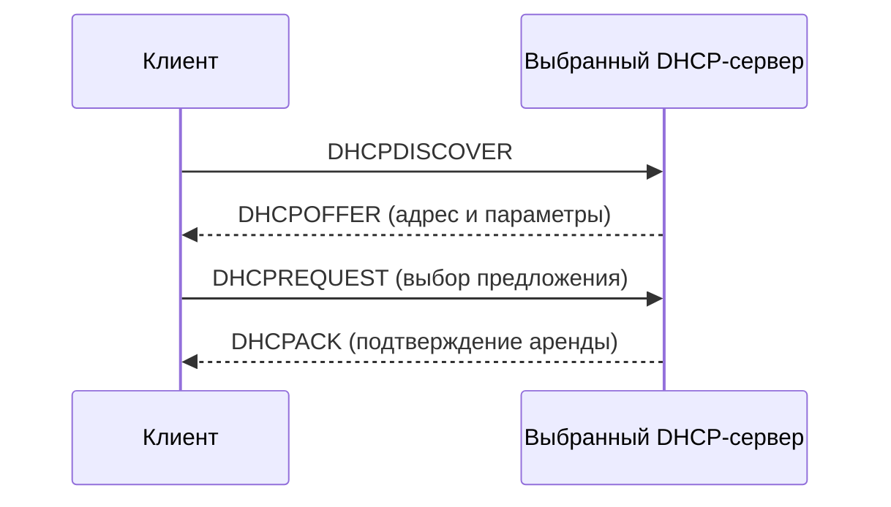

# DHCP

Страница описывает DHCP для IPv4 (DHCPv4). DHCPv6 — отдельный протокол с другим набором сообщений; DORA к нему не применяется.

### Описание

**DHCP (Dynamic Host Configuration Protocol)** — это протокол динамической конфигурации хостов, который позволяет автоматически назначать [IP-адреса](../fundamentals/ip-addressing.md) и другие сетевые параметры компьютерам в сети. Это значительно упрощает управление сетевой инфраструктурой, особенно в крупных сетях.

#### Основные функции DHCP:

- **Автоматическое назначение IP-адресов**: DHCP автоматически присваивает IP-адреса и другие конфигурационные параметры, такие как маска подсети и шлюз по умолчанию.
- **Требования инфраструктуры**: Для работы DHCP требуется наличие DHCP-сервера, который управляет распределением адресов и следит за уникальностью их использования.

#### Компоненты DHCP:

- **Клиент DHCP**: Устройство, которое запрашивает и получает IP-адрес от DHCP-сервера.
- **Сервер DHCP**: Устройство, которое управляет пулом IP-адресов и назначает их клиентам. Сервер ведет учет назначенных адресов, чтобы избежать дублирования.

#### Процесс получения IP-адреса

- **Сообщения DHCP**:
    - **DISCOVER**: Клиент ищет DHCP-сервер.
    - **OFFER**: Сервер предлагает IP-адрес клиенту.
    - **REQUEST**: Клиент запрашивает предложенный IP-адрес.
    - **ACK**: Сервер подтверждает назначение IP-адреса.
    - **NAK (DHCPNAK)**: Сервер сообщает, что запрос адреса недопустим, например адрес не подходит для текущей сети.
    - **RELEASE**: Клиент освобождает IP-адрес.
    - **INFORM**: Клиент с уже настроенным адресом запрашивает дополнительные параметры без получения новой аренды.
    - **DECLINE**: Клиент сообщает, что предложенный адрес уже используется.

#### Обмен при получении новой аренды

DORA — упрощённый успешный обмен для новой аренды, без relay и остальных предложивших серверов. Клиент может получить несколько OFFER и выбрать один; OFFER ещё не означает назначение адреса. После ACK клиент проверяет конфликт адреса и при его обнаружении отправляет DECLINE. Transport delivery и направление broadcast/unicast зависят от состояния клиента и полей сообщения.

Продление аренды не требует полного DORA: при T1 клиент пытается продлить её у исходного сервера, при T2 — у любого доступного. По умолчанию T1 — половина срока аренды, T2 — 0.875 срока; сервер может передать другие значения. При истечении аренды клиент прекращает использовать адрес, если продление не состоялось.

#### Назначение адресов в DHCP

- **Ручное назначение / reservation**: Адрес задаёт администратор; идентификация клиента зависит от настроек сервера и client identifier, а не обязательно только от MAC.
- **Автоматический**: Сервер назначает постоянный адрес.
    
- **Динамический**: IP-адрес выбирается из пула доступных адресов, управляемого DHCP-сервером.
    
- **Пул адресов**: Диапазон IP-адресов, которые могут быть назначены DHCP-сервером. Сервер следит за уникальностью назначаемых адресов.
    

При динамическом назначении IP-адрес выдаётся клиенту на ограниченный срок, называемый "время аренды" (lease time). После истечения этого срока адрес может быть использован другим клиентом.

#### Прекращение использования IP-адреса

- **DHCP Release**: Сообщение, которое клиент отправляет серверу для освобождения IP-адреса. В случае его отсутствия сервер удерживает адрес до истечения времени аренды.

#### Дополнительная конфигурационная информация

- Помимо IP-адреса, DHCP может передавать дополнительные параметры:
    - Маску подсети
    - Шлюз по умолчанию (маршрутизатор)
    - DNS-серверы
    - Адреса серверов времени и другие параметры

#### Поиск DHCP-сервера

При первичном обнаружении клиента broadcast-сообщения не проходят через обычный router. DHCP Relay позволяет связаться с сервером в другой сети. Продление аренды уже настроенным клиентом может использовать unicast к серверу. DHCPv4 использует UDP: порт сервера 67, клиента 68.

### Краткое содержание

**DHCP (Dynamic Host Configuration Protocol)** — протокол, позволяющий автоматически назначать IP-адреса и другие сетевые параметры компьютерам в сети. Это упрощает управление сетевой инфраструктурой, особенно в динамичных или крупных сетях.

## См. также

- [IP-адресация](../fundamentals/ip-addressing.md)
- [UDP](../transport/udp.md)
- [DNS](dns.md)

## Источники

- [RFC 2131: DHCPv4, обмен сообщениями и аренда](https://datatracker.ietf.org/doc/html/rfc2131)
- [RFC 2132: DHCP options](https://datatracker.ietf.org/doc/html/rfc2132)
- [RFC 9915: DHCPv6, отдельный протокол](https://www.rfc-editor.org/info/rfc9915/)
